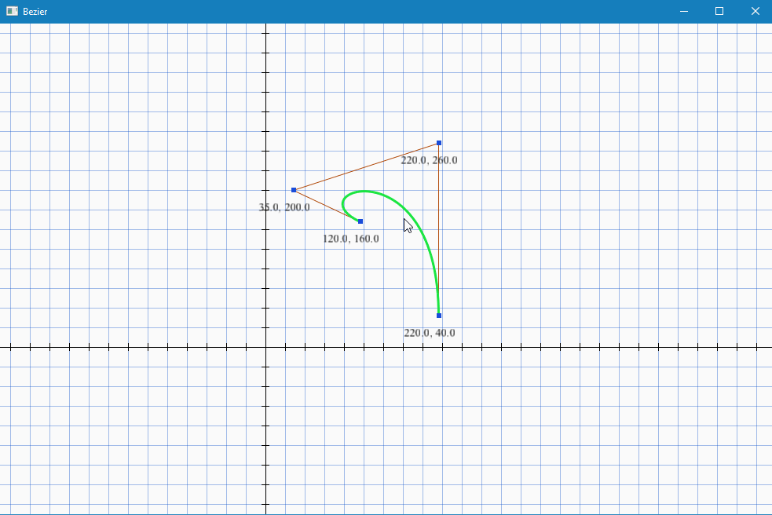

Bezier
======

A simple program that renders a bezier curve that the user can
manipulate using SDL2 and OpenGL.

Demo
----

Usage
-----

* Right mouse button to pan the display grid.
* Mouse wheel to scroll in and out.
* Left mouse button on a bezier point to move it around.

Building
--------

Bezier has a few dependencies:

* [glad](https://github.com/Dav1dde/glad) -- OpenGL loading.  Included
  with this repository.
* [stb_truetype](https://github.com/nothings/stb) -- Font loading.
  Included with this repository.
* [SDL2](https://www.libsdl.org) -- Platform handling.  Not included
  see below.

For SDL2 you will need to download the appropriate development library
for your system (N.B. the development library _not_ the runtime
binary).  Once downloaded, unzip the archive and move the development
library folder to the `vendor` folder in the this project directory.
If done correctly then the path to SDL2 should look like this:

`/path/to/bezier/vendor/SDL2-2.0.5/`

Bezier was developed with SDL2 version 2.0.5 but should work newer
versions.  With the SDL2 dependency out of the way you can run the
`build.bat` script from the project directoy under a command prompt
that has VC environment variables loaded through the `vcvarsall.bat`
script that ships with Visual Studio.  Visual Studio has a command
prompt that does this for you, just type `command` in the Windows
start menu search and it should be one of the top choices on the list.
Once built you can find a `bezier.exe` executable under a build folder
in the project directory.

While the build script provided is for Windows it should be pretty
easy to build on other platforms as bezier uses
a [unity build](http://buffered.io/posts/the-magic-of-unity-builds/).
